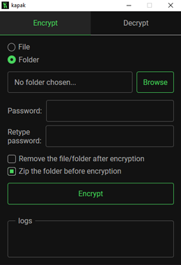
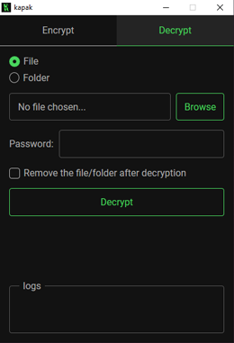

# Kapak: A simple-to-use file encryption script
```
$ kapak

    ▄ •▄  ▄▄▄·  ▄▄▄· ▄▄▄· ▄ •▄
    █▌▄▌▪▐█ ▀█ ▐█ ▄█▐█ ▀█ █▌▄▌▪
    ▐▀▀▄·▄█▀▀█  ██▀·▄█▀▀█ ▐▀▀▄·
    ▐█.█▌▐█ ▪▐▌▐█▪·•▐█ ▪▐▌▐█.█▌    v3.1.0
    ·▀  ▀ ▀  ▀ .▀    ▀  ▀ ·▀  ▀

Description: A simple-to-use file encryption script which
             uses AES symmetric encryption methods
Link:        https://github.com/amis-shokoohi/kapak

Help:        kapak [ -h | --help ]
```

## Description
Kapak can encrypt/decrypt **files and folders** by<br>
a given password using _AES_ symmetric encryption methods.

> If you are wondering what _kapak_ means, it means _mold_.<br>
> As moldy food is not eatable, kapaky files are not readable.

- [installation](#Installation)
- [usage](#Usage)
- [examples](#Examples)
- [password](#Password)

## Installation
### Linux
Make sure Python 3 is installed.
```
$ python3 --version
```
Install requirements:
```
$ pip3 install -r requirements.txt
```
Then run the installation script as **root** user:
```
$ cd kapak
$ chmod +x ./install.sh
$ sudo ./install.sh
```
### Windows
Download zipfile from [here](https://github.com/amis-shokoohi/kapak/releases/download/v3.1.0/kapak-windows-v3.1.0.zip).<br>
You can use `kapak.exe` now, but if you want to run it from anywhere in your system, follow instruction below:
- Right click on `install.cmd` and click on `Run as administrator`.
- Add `C:\PROGRA~1\kapak` to `Path` environment variable.

## Usage
You can either use the GUI ( Grpahic User Interface ) or the CLI ( Command Line Interface ) version of Kapak:<br>
### GUI
To use the GUI in Windows just search `kapak-gui` in the searchbar.<br>
To use the GUI in Linux run `kapak-gui` in the terminal.
<p align="center">
	
	
</p>

### CLI
```
$ kapak -h

Usage: kapak [GLOBAL OPTIONS] COMMAND [COMMAND OPTIONS] PATH

Global Options:
  -h, --help     Prints help message
  -v, --version  Prints version

Commands:
  encrypt  Encrypts the specified file/directory
  decrypt  Decrypts the specified file/directory
```
```
$ kapak encrypt -h

Usage: kapak encrypt [OPTIONS] PATH

Options:
  -h, --help         Prints help message
  -r, --remove       Removes the target file/directory
  -z, --zip          Zips the directory before encryption
  -b, --buffer-size  Buffer size in megabytes (default: 64)
```
```
$ kapak decrypt -h

Usage: kapak decrypt [OPTIONS] PATH

Options:
  -h, --help         Prints help message
  -r, --remove       Removes the target file/directory
  -b, --buffer-size  Buffer size in megabytes (default: 64)
```
## Examples

### Linux
```
$ kapak encrypt -rz ~/new-dir
$ kapak encrypt -r ~/movie.mp4
$ kapak decrypt -b=32 ~/movie.kpk
```

### Windows
```
C:\> kapak encrypt -rz "C:\New folder"
C:\> kapak encrypt -r "C:\movie.mp4"
C:\> kapak decrypt -b=32 "C:\movie.kpk"
```
> There is a problem with Windows paths that you might face with it.<br>
> Do NOT leave \\" or \\' at the end of the path, like ~~"C:\New folder\\"~~ .

## Password
Password length:<br> 
- min: 3 characters
- max: 1024 characters

After you run the script, it will prompt you to enter password.<br>

### There is an alternative way to provide the script with a password.
Create a file and name it `password.txt` whithin the `kapak` directory and put your password in it.
```
$ cd kapak
$ echo 'My$tr0n9P@ssw0rD' > password.txt
```
After you run the script, it will consume the `password.txt` file and will remove it after the operation is completed.
