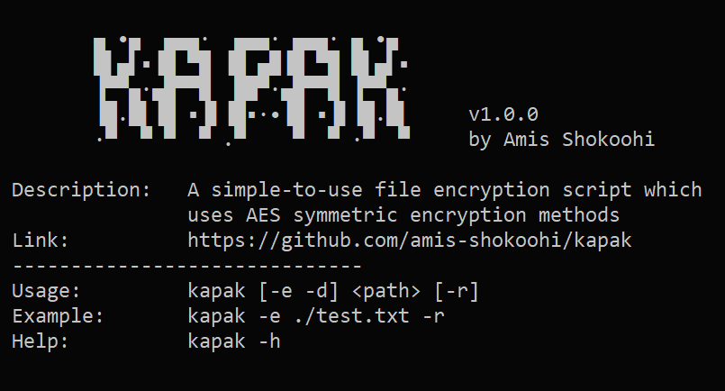

# KapaK script
### A simple-to-use file encryption script


### Description
This script encrypts **a file** or **files whithin a directory recursively** by<br>
a given password using _AES_ symmetric encryption method.

> If you are wondering what _kapak_ means, it means _mold_.<br>
> As moldy food is not eatable, kapaky files are not readable.

- [installation](#Installation)
- [usage](#Usage)
- [examples](#Examples)
- [password](#Password)
- [contribute](#Contribute)

### Installation
#### Linux
>Make sure Python 3 is installed.

Install requirements:
```
$ pip install -r requirements.txt
```
Then run the installation script as **root** user. It will copy files into `/bin/kapak` directory and add it to the `PATH`:
```
$ cd kapak
$ chmod +x ./install.sh
$ sudo ./install.sh
```
> NOTE: I've only tested this on Debian based distros.
#### Windows
Download zipfile from [here](https://github.com/amis-shokoohi/kapak/archive/kapak.zip).<br>
You can use `kapak.exe` now, but if you want to run it from anywhere in your system, follow instruction below:
- Right click on `install.cmd` and click on `Run as administrator`.
- Open Windows search bar and search for `var`. Click on `Edit the system environment variables`. Click on `Environment Variables...`. In `User variables` section look for `Path`, choose it and hit the `Edit...` button. Click on `New` and paste `C:\PROGRA~1\kapak`. Click `OK` `OK` `OK`, and you're done. Open a terminal an type `kapak`, you should be able to see its logo.

### Usage
```
$ kapak [-e -d] <path> -r
$ kapak -e ./test.txt -r
```
> The positions of **path** argument and **flags** are not important.

For help use `-h` or `--help` flag.<br>
For encryption mode use `-e` or `--encrypt` flag.<br>
For decryption mode use `-d` or `--decrypt` flag.<br>
If you want to remove the target files after the process, use `-r` or `--remove` flag.

### Examples

#### Linux
```
$ kapak -e ~/new-dir
$ kapak -e ~/movie.mp4 -r
$ kapak -d ~/movie.kpk -r
```

#### Windows
```sh
C:\> kapak -e "C:\New folder"
C:\> kapak -e "C:\movie.mp4" -r
C:\> kapak -d "C:\movie.kpk" -r
```
> There is a problem with Windows that you might face with it.<br>
> Do NOT leave \\" or \\' at the end of the path, like ~~"C:\New folder\\"~~ .

### Password
Password length:<br> 
- min: 3 characters
- max: 1024 characters

After you run the script, it will prompt you to enter password.<br>

#### There is an alternative way to provide the script with a password.
Create a file and name it `password.txt` whithin the `kapak` directory and put your password in it.
```sh
$ cd kapak
$ echo 'My$tr0n9P@ssw0rD' > password.txt
```
After you run the script, it will consume the `password.txt` file and will remove it after the operation is completed.

### Contribute
Feel free to contribute however you want.
